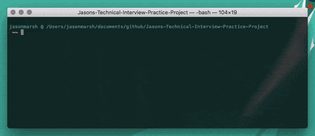

# Jasons Technical Interview Practice Project



## Description

This project's goal was to develop a set of functions written in Python that each answers a different question:

1. Search two strings for matching substring anagrams
2. Find longest palindromic substring contained in a string
3. Determine the minimum spanning tree within a undirected graph
4. Calculate least common ancestor between two nodes in a BST
5. Find an element in a singly linked list, m elements from end

Though the project didn't call for it, I took the next step to create a fun little command line interface app that lets you bounce from module to module rather than need to run them each separately.

## Requirements

- [Python 3.5.5 (or greater)](https://www.python.org/downloads/release/python-355/)

## Quick Start

1. Download and install [Python 3.5.5 (or greater)](https://www.python.org/downloads/release/python-355/) To check to see if you already have Python installed as well as what version, in a command prompt type `python --version`.

2. Download or clone [this repository](https://github.com/Minimalistic/Jasons-Technical-Interview-Practice-Project.git)
3. Navigate to the home folder of the project directory in a command prompt and type `python3 app.py`

4. You should now be presented with a CLI that looks like this: 

```
░░░░░░░░░░░░░░░░░░░░░░░░░░░░░░░░░░░░░░░░░░░░░
Welcome to Jason's Interview Practice Project
░░░░░░░░░░░░░░░░░░░░░░░░░░░░░░░░░░░░░░░░░░░░░

1) Seach two strings for matching substring anagrams
2) Find longest palindromic substring contained in a string
3) Determine the minimum spanning tree within a undirected graph
4) Calculate least common ancestor between two nodes in a BST
5) Find an element in a singly linked list, m elements from end
6) Exit

Select an option 1-6: 
```
